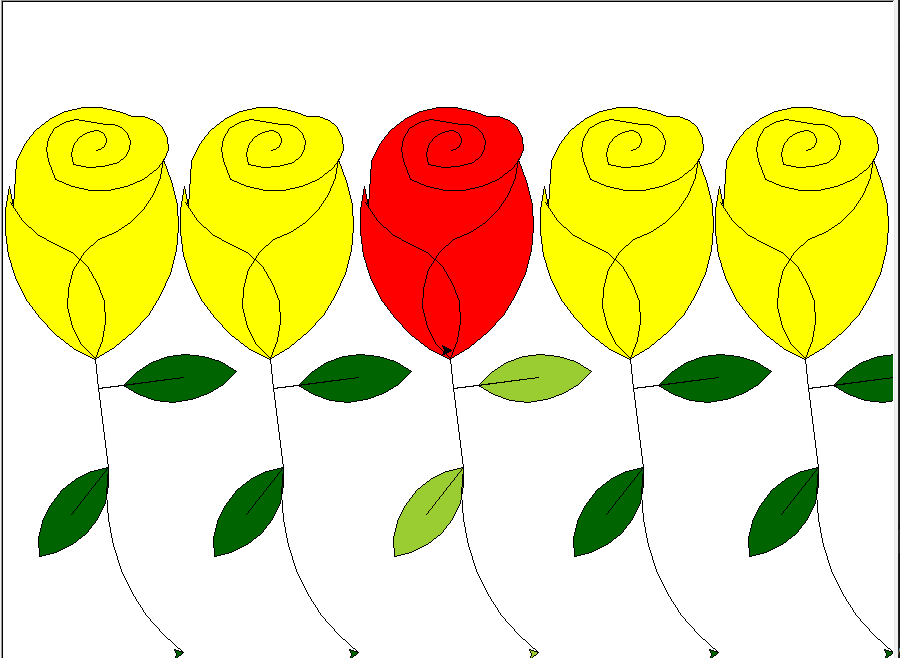

# Flores Amarillas

Este repositorio contiene un proyecto de dibujo de flores amarillas utilizando la biblioteca Turtle Graphics en Python.

## Descripción del proyecto

El proyecto consiste en dibujar flores amarillas de forma artística utilizando la tortuga de Turtle Graphics. Incluye varios diseños de flores y una animación simple.

## Autor: Derechos a quien corresponda

## Instrucciones de uso

1. Clona este repositorio en tu máquina local:

2. Ejecuta el código Python para dibujar las flores.

## Ejemplos de flores

## Contribuir

Si deseas contribuir a este proyecto, ¡estamos abiertos a colaboraciones! Puedes enviar solicitudes de extracción (pull requests) con mejoras, correcciones de errores o nuevos diseños de flores. [Enlace al repositorio](https://github.com/JUAND4V1D/Flores_amarillas)

## Modificador por: 

- Nombre: Juan David Condori Cari
- Correo electrónico: jc70196106@email.com

¡Gracias por visitar nuestro repositorio!
